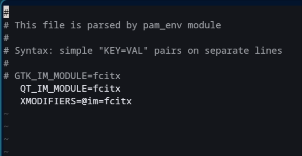

# My Journey to Perfect Singlish Typing on Linux

When I migrated to Linux, specifically a modern Wayland-based Arch distribution, the ecosystem felt amazing. But trying to get a proper Sinhala typing experience going was one of the most frustrating, yet ultimately rewarding, configuration journeys of my setup so far.

## Where It Started

I rely heavily on the Helakuru layout for Singlish typing. The initial goal was just to get it working on CachyOS — but trying to force the Windows app through Wine was a buggy mess, and attempting to install Ubuntu `.deb` packages broke system dependencies. I realized I needed to build a native, real solution, not just rely on workarounds.

## The Tech Stack

For the native typing setup, I chose:

| Technology        | Purpose                                  |
| ----------------- | ---------------------------------------- |
| Fcitx5            | Primary input method framework           |
| m17n-db           | Phonetic database engine                 |
| Noto Fonts Extra  | Rendering complex Unicode characters     |
| Neovim            | Editing and customizing the layout files |
| GitHub CLI (`gh`) | Publishing the custom configuration      |

## Key Challenges

### 1. Environment Variables on Wayland

Modern Linux environments require specific variables to route your keyboard strokes. On Wayland, this was tricky because it handles inputs differently than X11. I had to configure my `/etc/environment` carefully:


```text
# Set up Fcitx5 for Qt and XWayland apps
QT_IM_MODULE=fcitx
XMODIFIERS=@im=fcitx

# Note: GTK_IM_MODULE is intentionally left out
# because Wayland handles GTK inputs natively.

```

### 2. The Strict Phonetic Trap

Once Fcitx5 was running, querying the `m17n` engine revealed a massive issue: it was strictly phonetic. The standard layout didn't support the Helakuru autocorrect shortcuts I was used to. Typing `x` just output an English "x" instead of the Anusvaraya/Binduwa (ං).

### 3. Creating the Helakuru Hybrid Override

The key insight was realizing I didn't have to accept the default layout. I copied the system configuration to a local directory (`~/.m17n.d/`) and customized the `.mim` file directly using Lisp-like mappings to match Helakuru:

```lisp
  ;; Custom Helakuru Compatibility Mappings
  ("aae" "ඈ")
  ("ee" "ඊ")
  ("uu" "ඌ")
  ("ea" "ඒ")
  ("oa" "ඕ")
  ("M" "ං")
  ("x" "ං")         ; Mapping 'x' to the Anusvaraya

```

## Custom mim file

I have pushed my custom mim file to github so any future users that need this setup can use my custermized mim file file link :

[Git Repository link](https://github.com/AsithaKanchana1/m17n-singlish-helakuru-customkeaymap.git)

## Lessons Learned

1. **Local configs over system files.** Modifying files in `/usr/share/` requires root and gets wiped during updates. Utilizing `~/.m17n.d/` saved my configuration permanently.
2. **Understand the display server.** So many bugs I encountered (like the "Wayland Diagnose" error) were because I didn't understand the difference between how X11 and Wayland handle GTK inputs.
3. **Don't trust the terminal for CTL.** Terminals struggle with Complex Text Layouts (CTL). Sinhala modifiers will float in the wrong places in Alacritty or Kitty. Always test layout changes in a GUI app like LibreOffice.
4. **Open source gives you total control.** If a layout doesn't match your muscle memory, you can literally rewrite the source file to fix it.

## What I'd Do Differently

If I were starting over:

- I'd completely skip trying to use Wine for the Windows app.
- I'd check the Arch Wiki for Fcitx5 Wayland compatibility from day one.
- I'd write a shell script to automate the folder creation and file copying process instead of doing it manually.

## The Result

The custom hybrid layout was successfully completed and completely replaced my need for external apps. It's open source on my GitHub (m17n-singlish-helakuru) if you want to check it out and use it on your own Linux machine.

> **Pro tip:** Don't fight the operating system by forcing Windows apps through emulators. Building or configuring a native Linux solution — even if it takes more time upfront — is always the most stable path.

---

_Published on June 12, 2026_
