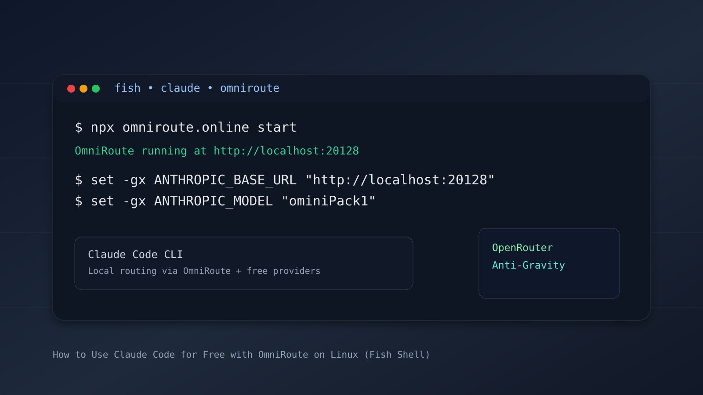

Claude Code is a powerful CLI tool for AI-assisted software development, but calling Anthropic APIs directly can get expensive over time.

I recently set up **OmniRoute** to route Claude Code through free providers, and it worked great. The catch: most setup guides assume Windows, Bash, or Zsh. If you are on Arch Linux with Fish shell, those commands often fail.

This guide shows the complete Linux + Fish workflow, including how to connect OpenRouter and Anti-Gravity so you can run everything end-to-end.



*Hero thumbnail: local Claude Code routing through OmniRoute with Fish shell environment setup.*

## Prerequisites

- Node.js installed
- Fish shell installed and active
- Internet access for initial package/provider setup

## Step 1: Launch OmniRoute

Start the local OmniRoute server:

```bash
npx omniroute.online start
```

After startup, OmniRoute runs at `http://localhost:20128`.

Open it in your browser and log in. Default password is `CHANGEME` (change it immediately after first login).

## Step 2: Connect Free Providers in OmniRoute (OpenRouter + Anti-Gravity)

To make this setup fully usable, configure providers before using Claude Code.

### 2.1 Add OpenRouter

1. Open the OmniRoute dashboard.
2. Go to **Providers**.
3. Click **Add Provider**.
4. Select **OpenRouter**.
5. Paste your OpenRouter API key.
6. Save and test the provider.

If you do not have a key yet, create one in your OpenRouter account dashboard, then return to OmniRoute.

### 2.2 Add Anti-Gravity

1. In **Providers**, click **Add Provider** again.
2. Select **Anti-Gravity**.
3. Enter the API key/token from your Anti-Gravity account.
4. Save and run the connection test.

### 2.3 Create a Combo and API Key

1. Go to **Combos**.
2. Create a new combo, for example `ominiPack1`.
3. Add your configured providers (OpenRouter and Anti-Gravity) to this combo.
4. Set routing/fallback order based on your preference.
5. Save the combo.
6. Generate an OmniRoute API key from the dashboard.

You need these two values for Claude Code setup:

- OmniRoute API key
- Combo name (example: `ominiPack1`)

## Step 3: Install Claude Code CLI

Install the official CLI globally:

```bash
npm install -g @anthropic-ai/claude-code
```

## Step 4: Configure Fish Shell Environment Variables

Most tutorials use `export` (Bash/Zsh) or PowerShell `$env:` syntax. In Fish, use `set -gx`.

Run these commands in your Fish terminal (replace placeholders):

```fish
# Route Claude Code to local OmniRoute
set -gx ANTHROPIC_BASE_URL "http://localhost:20128"

# OmniRoute API key
set -gx ANTHROPIC_API_KEY "your_omniroute_api_key_here"

# OmniRoute combo name
set -gx ANTHROPIC_MODEL "ominiPack1"

# Prevent unknown-model warning from limiting context window
set -gx CLAUDE_CODE_DISABLE_UNKNOWN_MODEL_WINDOW_ENFORCEMENT 1
```

Why the last variable matters:

- Claude Code expects Anthropic model names like `claude-3-7-sonnet`.
- Custom combo names like `ominiPack1` can be flagged as unknown.
- This flag suppresses the warning and avoids an artificial context-window cap.

## Step 5: Make the Configuration Permanent

To avoid retyping variables in every new shell session, add them to Fish config.

Edit config:

```bash
nvim ~/.config/fish/config.fish
```

Paste the same four `set -gx` lines at the bottom, then reload:

```fish
source ~/.config/fish/config.fish
```

## Step 6: Start Claude Code

From any project directory, run:

```bash
claude
```

Claude Code now routes through your local OmniRoute instance and uses the providers in your combo.

## Troubleshooting (Linux + Fish)

- `Unknown command: export`:
  - You are using Bash syntax in Fish. Use `set -gx`.
- `expanded command was empty`:
  - Usually a malformed Fish variable command. Re-check quotes and spacing.
- OmniRoute not reachable:
  - Confirm OmniRoute is running and `http://localhost:20128` opens in browser.
- Invalid key/model errors:
  - Re-check `ANTHROPIC_API_KEY` and `ANTHROPIC_MODEL` values.

---

Published on August 26, 2026. BY Asitha Kanchana Palliyaguru
